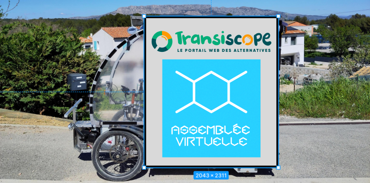
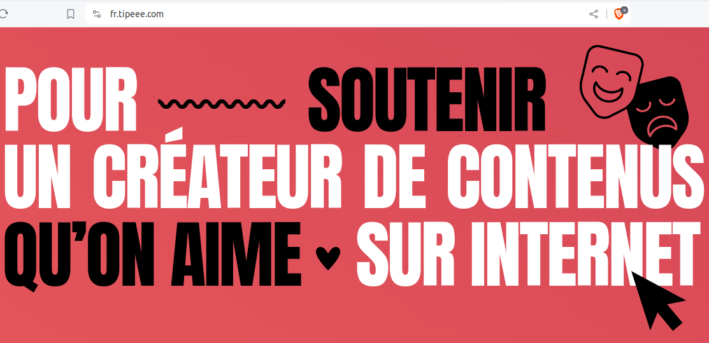
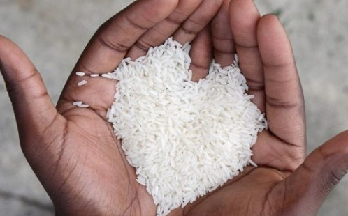
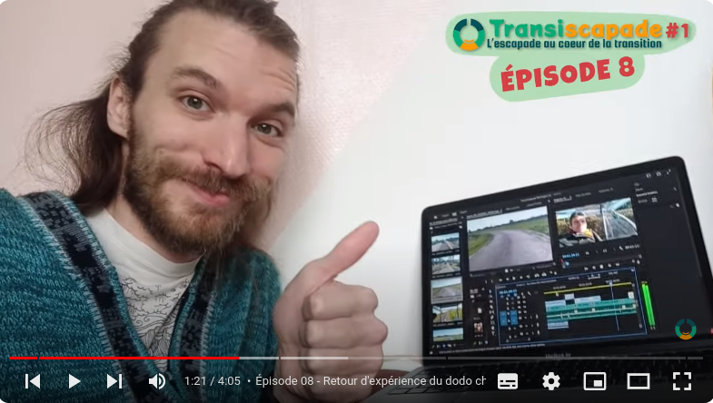
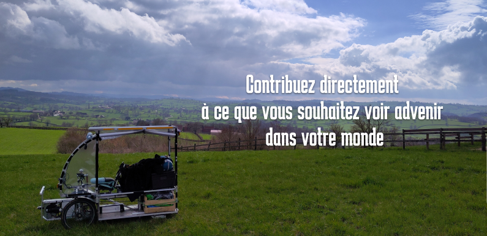

## Merci !
Tout d'abord, avant de parler de financement participatif, nous tenons à remercier tous ceux et celles qui ont déjà donné sur notre [Tipeee](https://fr.tipeee.com/transiscapade/).

## Pourquoi avoir besoin d'un financement ?

**Le "monde" de la transition est encore jeune**. Nous sommes encore peu nombreu.x.ses. Le "marché" dans ce domaine est donc encore faible, il y a **peu de monnaie en circulation** dans ces réseaux. Même si de plus en plus de consciences s'éveillent à vouloir/pouvoir "vivre autrement", le constat est que cela n'intéresse pas encore grand monde à l'échelle de la planète. 

Certain.e.s diront que **"c'est vieux comme le monde !..."** et qu'on sait des choses depuis longtemps à ce sujet... En effet, on peut citer [L'an 01](https://fr.wikipedia.org/wiki/L%27An_01) ou [La belle verte](https://fr.wikipedia.org/wiki/La_Belle_Verte), qui sont des classiques prouvant que d'autres modes de pensée existaient déjà il y a 50 ans. Mais malgré ça, nous n'avons pas encore dépassé le "point de bascule", qui permet à une société de prendre conscience, et de changer. Nous ne répondons pas clairement à un besoin exprimé par le plus grand nombre, et donc, la monnaie servant à "mesurer les échanges", il y a peu d'échanges dans ce domaine, et c'est tout à fait normal qu'il y ait peu de monnaie allouée pour cela.

J'aime expliquer qu'en comparaison, le **marché du football** (sans aucun jugement, j'aurais pu parler du marché de l'alcool ou de la drogue...), intéresse des milliards de personnes, ce qui explique que le marché soit très développé, que beaucoup de monnaie transite dans ces réseaux. Le système économique capitaliste fonctionne ainsi, je pourrais m'en attrister, mais je préfère dire que "c'est" (ainsi).

Je ne suis pas fataliste, j'ai longtemps essayé d'accompagner et d'utiliser des modèles alternatifs à nos monnaies capitalistes, comme les **monnaies locales** ou plus particulièrement **[la monnaie libre (G1/June)](https://monnaie-libre.fr/)**, mais cela a été un échec (au bout de 7 ans quand même...) dans ma région. Notre rapport à l'argent soulève en effet tous pleins de blocages qui mettrons du temps, et c'est grâce à cet échec, que j'ai commencé à essayer de comprendre mieux nos fonctionnements humains.

Voilà donc une dizaine d'années que je participe, autant que je peux (surtout bénévolement), à cartographier les alternatives sur le territoire. Et c'est le cas de beaucoup de personnes autour de moi, qui prennent de leur temps et de leur énergie, à mettre en lumière des alternatives à la sueur de leur front, bénévolement. **A force de travailler bénévolement, on s'épuise**. C'est le cas de beaucoup d'entre nous. De mon côté, j'ai arrêté depuis deux ans de travailler bénévolement.

En conclusion, pour la majorité des projets dans lesquels je suis impliqué, nous avons besoin d'aller chercher des financements, et de tester plusieurs outils financiers (subventions publiques, mécénat, financement participatif...).

## Pourquoi avoir choisi un financement participatif ?

Le projet Transiscapade accompagne celui de [Transiscope](https://transiscope.org) et aussi celui de l'[Assemblée Virtuelle (AV)](https://virtual-assembly.org) qui est très proche. C'est une sorte de "mise en avant", un outil de communication, en même temps qu'une "connexion réelle" aux territoires pour continuer la cartographie.

Depuis une dizaine d'année, j'utilise l'outil de **financement participatif** pour **"voter avec mon argent"** ce que je veux voir advenir dans mon monde. C'est pour moi un mode d'expression et de démocratie qui permet de choisir/soutenir les projets qu'on aime, les valeurs qui nous parlent, les gens qui nous font vibrer, n'ayant pas le temps de m'impliquer dans chacun d'eux.

De mémoire, voici une petite liste de projets que j'ai soutenu grâce au financement participatif. C'était pour moi à l'époque une vrai **révolution** : 
* [Socialter](https://www.socialter.fr/) (un magazine alternatif)
* [Le mouvement colibris](https://www.colibris-lemouvement.org/)
* [Le mouvement Alternatiba](https://alternatiba.eu/)
* Une dizaine de reportages, des livres...
* Et tous les projets auxquels j'ai participé (jardins partagés, monnaie libre, communs numériques...)

J'ai aussi soutenu avec mon porte-monnaie des produits que j'ai directement acheté, comme par exemple des t-shirts qui font attention à la quantité d'eau consommée, ou des savons, ou tout simplement des maraichers en achetant leur panier.

C'est le côté "sans intermédiaire" qui m'intéresse dans l'histoire. Ok, il y a souvent des plateformes entre les deux, et c'est la raison pour laquelle je travaille au développement de plateformes éthiques avec l'[Assemblée virtuelle](https://virtual-assembly.org)

Là encore, dès que nous aurons posé les fondements d'un Web qui gère mieux les données personnelles, nous pourrons proposer différentes plateformes, dont des fonctionalités de financement participatif.

## Pourquoi avoir choisi la plateforme Tipeee ?

Nous avons choisi la plateforme Tipeee :
* parce qu'elle est connue et très souvent utilisée par les créateurs de contenus, elle donne donc plus confiance, et en ce qui concerne le rapport à l'argent, la confiance, c'est important.
* par simplicité, j'ai créé le compte en 5 min, et j'ai eu les permiers soutiens le lendemain

J'aurais préféré avoir pris le temps de critiquer son modèle économique... 

Pour le projet Transiscapade, j'ai fait une croix sur beaucoup de mes valeurs dans le choix des outils numériques. J'aurais préféré utiliser [PeerTube](https://peertube.virtual-assembly.org/) au lieu de Youtube, [OpenCollective](https://opencollective.com/), au lieu de [Tipeee](https://fr.tipeee.com/), ne pas utiliser les réseaux sociaux des GAFAM (Facebook et Instagram), mais j'expliquerai ces choix dans un futur article (une histoire d'acceptation du monde tel qu'il est...).

L'[Assemblée Virtuelle](https://virtual-assembly.org) utilise [OpenCollective](https://opencollective.com/virtual-assembly), dont le modèle économique et la plateforme (open-source) sont plus ouverts.

Le projet [Transiscope](https://transiscope.org) utilise [HelloAsso](https://transiscope.org/campagne-don/) pour sa campagne de don.

## C'est un peu "faire l'aumone", non ?

Lorsque j'entends cela, j'ai d'abord une profonde pensée pour toutes les personnes qui ont le courage de demander de l'aide sans avoir la force de rendre quelque chose en échange. D'ailleurs, si on creuse, ces personnes ne sont pas là pour rien. Elles sont le reflet d'une partie de nous que nous ne voulons pas accepter, pas voir... Je vous laisse avec ça :)

De mon côté, je n'ai pas cette "qualité". Jusqu'à présent, dès que je faisais quelque chose, je recherchais l'équilibre... Je ne pouvais pas manger lors d'un repas partagé, plus que la quantité que j'avais apporté... **Je souhaitais donner autant que je recevais**. Dans ce voyage, je souhaite bousculer un peu ce besoin d'équilibre, et observer comment je me sens lorsque, par exemple, quelqu'un m'héberge sans compensation. Oui, je ressens une sorte de dette envers ielle. Mais n'est-ce pas un lien qui nous lie ? Et peut-être qu'un jour ce sera l'inverse ? (d'ailleurs, tous mes hôtes sont les bienvenus où je vis !)

Comme dirait quelqu'un de sage : **"tout travail mérite salaire"**. Mais dans mon cas, philosophiquement, ce que j'aimerais, ce n'est pas un "salaire", j'aimerais ne plus passer par de grandes structures (publiques ou privées) pour être rémunéré, et je serais très heureux de sentir que mes actions sont soutenues directement par des humains ! Quel pied, de sentir que mon voyage est poussé par moi-même, le soleil, et par des milliers d'amis et de gens que je ne connais même pas !...

J'ai l'impression que mon action sert à quelque chose. Via cette Transiscapade, j'ai l'impression d'apporter ma goutte d'eau au monde. Alors oui, j'espère recevoir en échange une compensation. D'ailleurs, une compensation n'est pas forcément financière ! Je recois régulièrement énormément d'encouragements sur les réseaux, et c'est vraiment appréciable car ça me donne de l'élan pour continuer, voir même une certaine inertie ! :)

## Financement les vidéos

C'est la principale raison de ce financement participatif.

C'est Nicolas qui s'occupe de monter les vidéos (merci à lui !). 
Il passe environ **4h en moyenne pour chaque vidéo**.

**Pour chaque vidéo :** 
* je lui envoie une cinquantaine de photos et de vidéos qu'il commence par trier, choisir les enchainements, un thème global, une trame...
* il ajoute du rythme avec des musiques (libres de droit), parfois, je lui envoie des extraits repris au ukulele...
* il incruste régulièrement des photos, des liens, pour étayer le propos
* il ajoute des textes, des titres, des sous-titres, pour améliorer l'accessibilité
* il ajoute la vidéo, le titre et la description sur youtube, et Instagram
* globalement, il ajoute sa "patte", sa "touche", pour donner à l'ensemble une certaine homogénéité et faire en sorte que la consultation des vidéos et du son soit agréable et intéressante.

Nous avons estimé ce travail à 100€ pour chaque vidéo.

Je suis super content du travail de Nicolas, de son écoute, de son sérieux, de son endurance, de sa présence, au téléphone, régulièrement, tout au long de mon trajet, du temps qu'il a passé, de son apport au niveau de la ligne éditoriale, de sa transparence etc. On forme une bonne équipe !

## Vélo-reporter, un vrai "travail" !

Même si on a l'impression que je me la coule douce dans les vidéos... :), je ne m'attendais pas vraiment à cela, mais l'activité de "vélo-reporter" est un vrai "travail" !
D'ailleurs, plus ça va et plus je conçois le mot **"travail"** non pas comme "tripalium" (instrument de torture), mais comme "travel" (voyage)... 

Voici la liste des choses que je dois réaliser tout au long du voyage, et qui pourrait s'assimiler à du "travail" : 
* **Au présent :**
  * Pédaler, prendre des **photos**, des **vidéos**
  * **Prendre soin de moi**, bien dormir, bien manger, bien boire, m'étirer souvent, me faire des journées "OFF". **Me laver** régulièrement, ainsi que mes habits. Faire de la musique, avoir des liens sociaux (ça, ça ne manque pas...).
  * **Faire attention** à la route, aux voitures, écouter le GPS, recharger mon portable en USB via la batterie du vhélio...
  * **Rester concentrer**, de 8h du matin, jusqu'à 18h le soir (et même la soirée, car c'est le minimum que je peux offir à mes hôtes !).
  * Faire attention aux **bruits du vhélio**, à l'**ensoleillement**, aux **batterie**, **réparer/améliorer** si besoin mon embarcation.
  * Répondre aux questions des gens concernant le **vhélio**
  * **Sourire** aux gens, leur **parler**, **m'intéresser** à ce qu'ils font (ca, c'est assez naturel, sinon, je ne me serais pas lancé dans ce projet...)
  * Parler de mon projet, de **cartographie des alternatives**, de **Transiscope**, d'informatique libre... 
  * M'adapter par rapport à ce que j'avais prévu.
  * Trouver tous les jours des **choses intéressantes à raconter** (pour ça, heureusement, la vie m'aide bien, ça me "tombe dessus"...)
  * Participer à ce qui se joue au présent, là ou je suis, **profiter du moment présent**. En réalité, j'ai bien du mal à vraiment profiter, ne rien faire (mais j'y "travaille", car ça s'apprend...)
  * Tous les soirs, trouver un moment (minimum 1h) pour **répondre aux commentaires** sur les **réseaux** et publier soit un épisode, soit des photos, soit un article de blog...
  * **Ne rien oublier** lorsque je m'arrête (surtout chez mes hôtes, j'ai pour ça une petite liste à valider tous les matins)...
* **Gérer le passé :** 
  * **Envoyer** les photos/vidéos à Nicolas pour qu'il réalise les vidéos du voyage passé
  * **Recontacter** les personnes que j'ai rencontré pour les tenir au courant de mon voyage
  * **Enregistrer** des voix Off sur les anviennes vidéos prises il y a quelques semaines
  * **Garder le contact** avec tous mes proches que j'ai un peu "abandonné" pour 3 mois...
  * Faire moi-même des publications sur **Instagram** (uniquement après Marseille...)
* **Anticiper le futur**
  * Faire des **courses de nourriture** (pour partager avec mes hôtes) ou chercher des **restos** proches
  * Prévoir les **scénarii** des futurs épisodes, planifier les vidéos en fonction des disponibilités de Nicolas.
  * Faire un **itinéraire** 2 semaines à l'avance (qui pourra évoluer en fonction des personnes que je rencontre).
  * Contacter les **"amis d'amis"** qui pouraient m'héberger, les **cyclistes** du réseau [warmshower](https://www.warmshowers.org/), et si je n'ai pas de réponse, trouver un **hotel** (booking/airbnb).
  * Bref, je suis à longeur de temps sur mon téléphone ! :(

**Je ne me considère pas en vacances...**. Je ne me plains pas non plus, car c'est moi qui l'ai choisi, c'est juste pour vous permettre d'évaluer un peu mieux ce que je produits, si vous souhaitez me rétribuer directement. Après, vous faites bien ce que vous souhaitez. Si le projet n'a pas assez de financement, il s'arrêtera et ce sera signe qu'il n'y en a pas besoin, tout simplement.

## Combien donner ?
Ce que vous souhaitez ! :)

Pour moi, le financement participatif, c'est **"une masse de personnes, qui donnent un petit peu chacun"**. Evidemment, si quelqu'un souhaite donner beaucoup, car le projet lui parle, il le peut, mais je préfère 1000 dons à 2€ que 100 dons à 20€. Et je m'occupe de trouver la masse !

## Fonctionnement et lien vers le financement participatif
Si vous souhaitez nous soutenir financièrement, vous pouvez choisir, soit des dons ponctuels, soit mensuels. Attention, tous les mois, le Tipeee revient à zéro (sauf les dons mensuels), et les dons sont virés sur mon compte.

C'est par ici : https://fr.tipeee.com/transiscapade/

Merci d'avoir lu jusqu'au bout ! :)

Yannick et Nicolas

