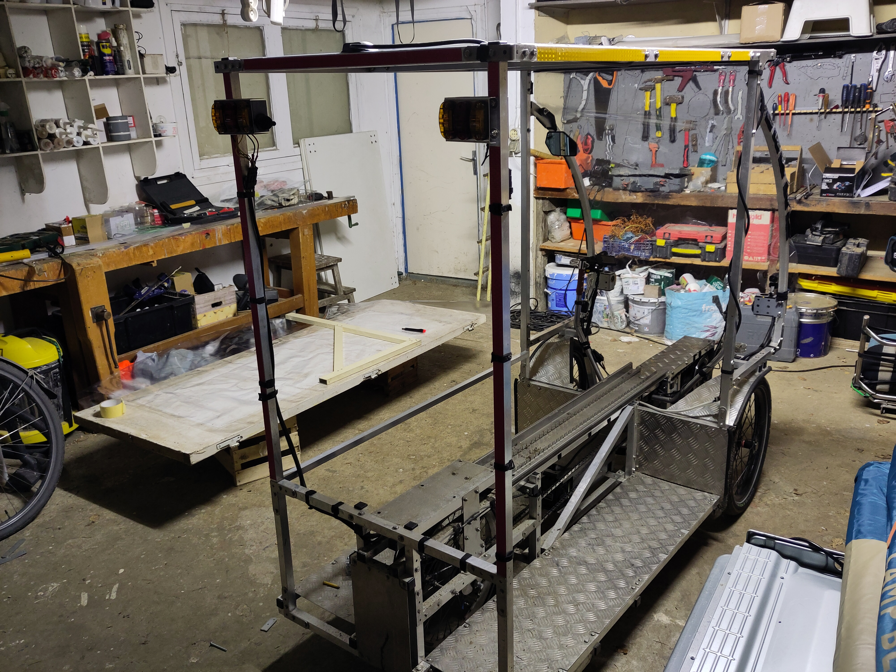
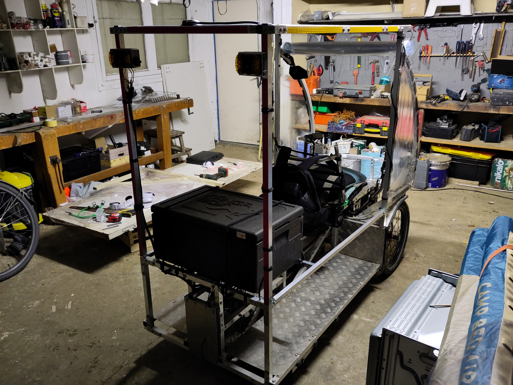

# En vidéo...
Retrouvez sur [la chaine youtube de la transiscapade](https://www.youtube.com/@Transiscapade), l'[Episode 1 - Préparation du vélo solaire](https://www.youtube.com/watch?v=lCHRIJVEt80)

# En détail...

## De l'idée à la concrétisation
Nous sommes le 16 février, il reste 2 semaines. A peu près, car je ne sais toujours pas quand je pars. Je sais où je dois être, et quand.

**Le 29 mars, à Marseille**, pour le [9ème Transiscothon](https://ferme.yeswiki.net/PWA_GareCentrale/?TransiscothonN9_Programme).

**Liste des choses à faire/penser/acheter**
- **communiquer** autour de moi à mes proches que je vais partir pendant au moins 2 mois
- commencer à communiquer sur les réseaux auprès de l'Assemblée virtuelle, de Transiscope, et de la communauté vhélio
- préparer un **itinéraire** inverse pour savoir quand je dois partir
- créer [**un financement participatif**](https://fr.tipeee.com/transiscapade/) pour présenter le projet et commencer à récolter un peu de sous pour faire les vidéos
- trouver **quelqu'un pour faire les vidéos** et communiquer sur les réseaux, car je n'arriverai pas à tout faire
- filmer **un teaser** pour mieux communiquer sur les réseaux avant de partir
- **préparer le vhelio**, acheter de quoi tenir au niveau des batteries, et avoir une protection de pluie
- savoir **comment** je vais dormir, me nourrir...
- réfléchir à qui je connais sur la route
- me préparer **physiquement**
- réfléchir à tout ce dont j'ai **besoin** pour un tel voyage

## Communication sur les réseaux
- [Le tipeee (financement participatif)](https://fr.tipeee.com/transiscapade/) a été fait en une journée, j'en suis très satisfait.
- J'ai annoncé 2 semaines avant sur les réseaux que je recherchais quelqu'un pour monter mes vidéos (en utilisant le tipeee pour expliquer le projet). J'ai eu 5 ou 6 réponses, j'ai sélectionné un ami, et je pense que j'ai bien choisi ! :)
- J'ai créé [une page facebook](https://www.facebook.com/profile.php?id=61556861211105) assez rapidement, Nico a créé un teaser dans la foulée avec peu de contenu, et c'est parti comme ça.
- Nous avons ensuite décidé d'utiliser youtube... Me voilà devenu un youtubeur en 2 semaines... lol

## Itinéraire inverse
Retrouvez sur [la chaine youtube de la transiscapade](https://www.youtube.com/@Transiscapade) [Le teaser de la première transiscapade, dans lequel j'explique l'itinéraire](https://www.youtube.com/watch?v=lCHRIJVEt80)

Je commence à regarder le [périple de Barnabé Chaillot](https://vhelio.org/suivez-le-periple-de-barnabe/) pour connaitre environ le nombre de km par jour qu'il est possible de faire avec le vhélio. Environ 50 km.

J'installe l'application [GéoVélo](https://geovelo.app/fr/) qui m'annonce plus de 1000 km, en passant par Orléans (Loire à vélo). En effet, au début, je voulais faire le même trajet que Barnabé (Lyon > Orléans), mais en sens inverse, ça me donnait une bonne base.
**Problème :** en calculant bien, je dois partir le 1er mars... Or, je suis encore en vacances, et je ne rentre que le 3 mars... Aïe. Il faut changer l'itinéraire, tant pis pour [la Loire à vélo](https://www.loireavelo.fr/), je me retranche sur [Le cher à vélo](https://www.val-de-loire-41.com/destination-loir-et-cher/la-vallee-du-cher/circuits-velo-vallee-du-cher/)...
Je recalcule, ça passe... juste. On tente ça.

Je coupe le trajet en 2 car j'ai des impératifs familliaux mi-mars. Je dois être le 13 mars à Lyon. Pif paf pouf, ça fait 10 jours pour aller à Lyon... après, on verra, ça devrait passer...

Je calcule donc des tronçons de 50 à 60 km en utilisant l'application Géovélo, et je trouve bien 10 étapes, ça fonctionne, go !

Conclusion : **départ lundi 4 mars**.

## Tente, hotel, Airbnb, warmshower... ?
Grosse question, le dodo...

### Dans le vhélio ?
Vu qu'on est pas à une idée farfelue de plus, **pourquoi je ne dormirais pas dans le vhélio ?**. Après tout, il fait 2m de long... ! J'ai donc acheté un sommier gonflable qui se met pile-poil dedans, mais au dernier moment, j'ai finalement décidé d'abandonner cette solution, qui me prendrait trop de temps à mettre en place.

### Tente ?
Une tente, fin février, il fait zéro degré le matin... non. (nous verrons plus tard que ça aurait pu être jouable dans le sud...)

### Habitant / hotel ?
J'ai finalement choisi un mixte entre "j'irai dormir chez vous" et booking.

Plus tard, je reparlerai de l'application [WarmShower](https://www.warmshowers.org/fr), qui m'a été d'une précieuse aide.

## Achats indispensables
Deux semaines avant, je décide d'acheter (en avance, je suis prévoyant...) : 
- une deuxième batterie de secours
- une boite légère isotherme [kangabox](https://www.laboiteisotherme.com/kangabox/847-kangabox-expert-gn-11-30l-.html) pour garder la nourriture au frais
- du film plastique en rouleau pour le pare pluie, ainsi que des scratchs

### Réception de la deuxième batterie
Voilà une semaine que je croyais la batterie arrivée à bon port. J'avais bien reçu une confirmation par SMS du livreur, comme quoi elle avait été donnée en main propre à madame... A madame ? OK, mais quelle madame ? 

J'ai eu beau demander à tous mes colocs, aux voisins etc, personne n'avait vu cette batterie ! Nous étions dimanche et le livreur était injoignable. Je commençais à faire une croix sur ma deuxième batterie, ce qui allait complexifier vraiment les choses.

Et puis, quelqu'une pense à aller voir à une adresse identique dans une autre ville proche... On sonne, on demande... suspens, et là, une dame nous confirme qu'elle a bien reçu un paquet qui ne lui appartient pas et qu'elle est bien embêtée avec !! Ouf ! J'ai ma batterie !...

### La boite isotherme
J'ai commandé la boite une semaine avant le départ. A l'heure ou j'écris ces lignes (3 semaines après), je ne sais toujours pas où elle a été livrée... Heureusement qu'on a pu m'en prêter une en dépannage ! (un grand merci...)

### Films plastique
On est dimanche, il me manque deux mètres de film plastique... Tout va bien, on est laaaarge !

- Premier magasin (genre foirefouille...) : "désolé, nous ne servons pas les films plastiques le dimanche" (c'est compréhensible...). 
- Deuxième magasin, c'est bon, ils en ont ! Ouf. Il est plus fin, mais ça fera l'affaire !

C'est bon, **j'ai tout le matériel indispensable** pour partir.

## Préparation du dimanche 3 mars
Le dimanche 3 mars, je rentre de vacances, vers 18h, et j'ai RDV avec Piem, qui ne se doute pas qu'il n'est pas près de se coucher...

Je vous passe les détails (manque de matériel pour faire un travail de qualité... nous avons dû faire avec ce que nous avions...), nous avons passé au moins 6h (en comptant le repas...) pour : 
- découper le film plastique avant et latéral et le poser avec des scratchs
- fixer 3 barres supplémentaires pour tenir la boite kangabox à l'arrière

Nous partons nous coucher à 2h du matin, rincés, mais sereins, on est laaaarge... il nous reste pour le lendemain matin : 
- A terminer les protections latérales et arrières
- A faire mon sac (rien n'était prêt... enfin si, tous mes habits étaient propres !)
- A accueillir le journaliste de Actu.fr pour le [reportage de départ](https://actu.fr/pays-de-la-loire/allonnes_72003/il-va-parcourir-pres-de-900-kilometres-en-un-mois-a-bord-dun-velo-solaire_60780828.html)

## Finalisation des préparatifs le matin du 4 mars
- Lever 7h, pas de petit dej, on se met directement à la tâche.
- Je commence un peu à faire mon sac... combien de chaussettes ? Il va faire chaud, froid ? Un pyjama ? Ohh, il emmène un pyjama, gnagnagna... pfff. Non mais c'est quoi ces injonctions anti-pyjama ?! Hé bien je suis bien content d'avoir pris mon pyj ! Et toc.
- 8h30, les films plastiques latéraux sont posés
- 9h, le journaliste appelle, je ne l'attendais plus, mais on est presque prêts, j'ai RDV à midi à Ecommoy, bon, allez, ça va passer...
- 10h : nous avons répondu aux questions du journaliste, on film le départ, faux départ, la capote avant se détache... Piem ajoute un super bout de ficelle à l'intérieur du rouleau (il fallait y penser n'empêche !). Et là, c'est vraiment le grand départ, les au-revoirs, le déchirement, ça me fait bizarre, je ne suis pas prêt de revenir, ai-je pensé à tout ? Finalement, **Oui**.

## Un grand merci

Un grand grand merci à Pim pour son aide, son adaptation, ses bonnes idées, son acceptation. On a passé une excellente soirée, détendus, on s'est bien marré, je ne regrette rien ! (j'ai juste beaucoup de chance...)

Merci aussi à celleux qui étaient présent.es sur la fin, et le matin, pour nous soutenir, et rigoler avec nous tellement c'était n'importe quoi ! Mais on l'a fait, et le résultat était au delà de mes espérances.

# En photo...

## Le sommier gonflable

## A 18h le dimanche 3 mars

## Vers 2h du matin...

