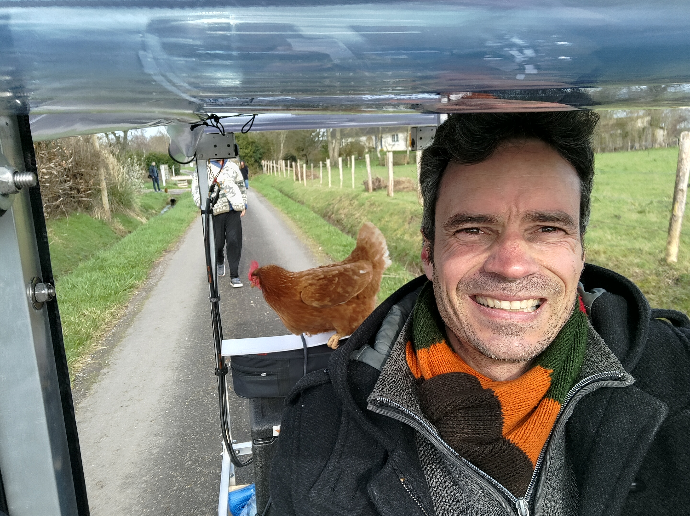
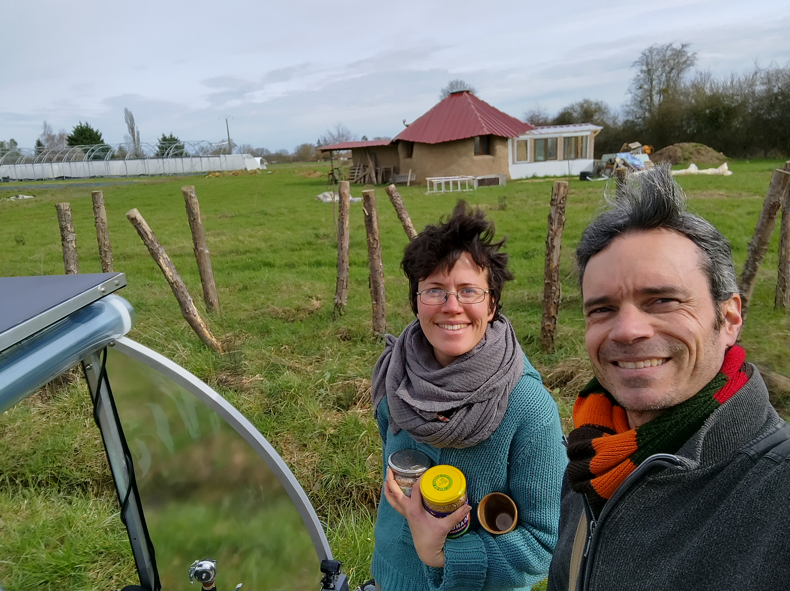
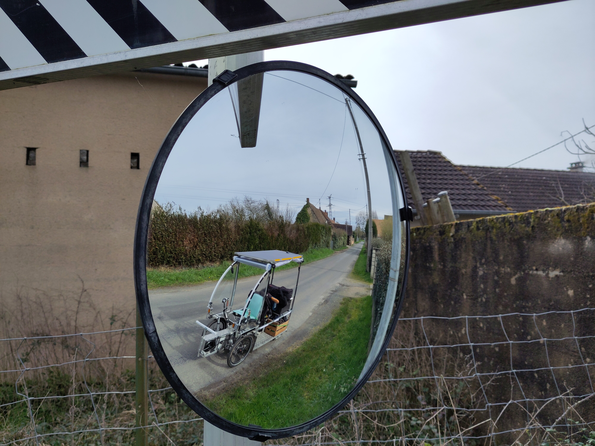
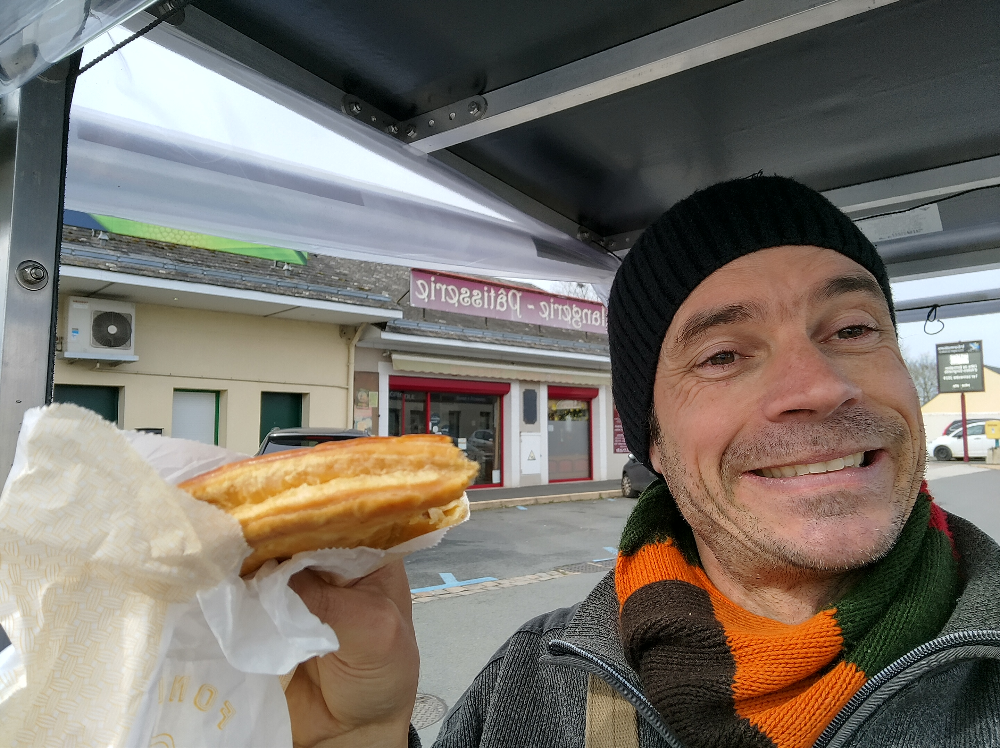
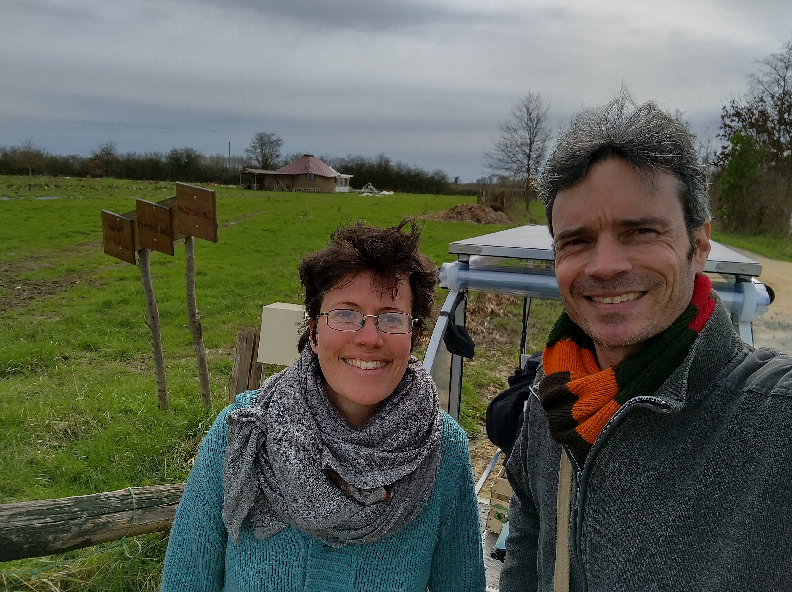

# En vidéo...
Retrouvez sur [la chaine youtube de la transiscapade](https://www.youtube.com/@Transiscapade), l'[Episode 2 - Les herbes folles à Ecommoy](https://www.youtube.com/watch?v=2ZQm_Ee5TcU)

# En détail...

## Le grand départ

Nous sommes le 04 mars, je n'ai pas beaucoup dormi, mais je suis toujours excité comme une puce et **j'ai la baraka** !

Je quite donc mes amis, ma famille, pour une période d'au moins deux mois. Je n'ai jamais fait ça de ma vie. C'est pour moi une sorte de **baptême initiatique**. 
Depuis tout petit, je n'ai pas beaucoup voyagé, je ne suis pas attiré par le tour du monde, au contraire, je préfère rester dans un périmètre de sécurité que je connais. 

Là, c'est donc pour moi un vrai **challenge**, j'ai envie de me confronter "raisonablement" au voyage, à l'inconnu, faire **confiance en la vie**... Je trouve que la France est un beau pays et qu'il y a déjà assez de diversité à découvrir avant d'aller plus loin.

## Ai-je oublié quelque chose ?
Pendant les premières minutes, je me dis : "Bon, si j'ai oublié quelque chose d'important, on pourra me les apporter à Ecommoy, il faut bien partir à un moment". Au final, je n'ai oublié que deux choses, mon couteau (j'en trouverai un sur la route), et ma fiole d'huile pour la chaine du vélo (j'ai croisé moultes magasins de cycles et autres garages vélo le long de ma route...). Moi qui d'habitude oublie beaucoup de choses, pour une fois, **j'ai pensé à tout**.

## Sentiment bizarre et moultes questions
A l'intérieur de moi, un mélange d'excitation, de peur, de déchirement... et surtout de **questionnements** divers :
* Vais-je tenir le coup physiquement ?
* Le vélo va-t-il tenir le coup ?
* Vais-je savoir le réparer si un problème technique apparait ?
* Est-ce que je suis bien assis, le siège est-il bien réglé pour mes jambes ?
* Combien de km suis-je capable de faire par jour ?
* L'itinéraire est-il bon ?
* Est-ce que je suis en retard pour mon premier RDV à Ecommoy ?
* Est-ce que je vais savoir faire les vidéos, les interviews ? Quel format ? Quelles questions poser ?...

On verra bien...

## Profiter du voyage... de l'instant présent
Et à un moment, pour **calmer mon mental**, je me dis : "profite, calme, regarde le paysage, connecte tes 5 sens...". Ahhh... voilà, c'est mieux. Je suis parti et tout va bien se passer.

## Dire bonjour au gens
Sourire au gens, **dire bonjour** à chaque passant, en les regardant droit dans les yeux. C'est ça, le contact le plus important. 
Comme dirait la chanson de Nitin Sawhney [Say Hello](https://www.youtube.com/watch?v=LRnd_3f4SPU).

## Passage à Spay

Je passe faire un coucou à des amis à Spay, et je leur demande une bouteille d'eau car je me rends compte que ma gourde est coincée dans le fond de ma boite isotherme, et que ce n'est pas pratique.

Leur bouteille fera le tour de France... :)

## Première interview à Ecommoy

Tout se passe bien jusqu'à Ecommoy, j'arrive à l'heure chez Claire à la ferme des herbes folles pour une **première interview**. Je suis super content de rencontrer Claire, comme si elle m'accompagnait dans le fait de quitter ma région, mes amis, tout en douceur...

On a bien mangé, fait assez rapidement l'interview, en quelques prises, l'essentiel du message était passé. Bravo à Claire pour ce pitch !

## Format court des vidéos
Certains d'entre vous ont été **frustrés** de ne pas voir les détails du Paligloo (dôme géodésique en palettes) et des serres de culture. Plusieurs raisons à cela : 
* Pour les vidéos, je souhaite commencer par un format court, qui va à l'essentiel
* Par la suite, j'ai d'autres supports informatiques pour décrire les lieux que je vais visiter.
* J'étais aussi un peu pressé par le temps, car je devais ensuite aller à Jupilles.
* Le paligloo n'était pas terminé

A l'avenir, je passerai plus de temps à décrire les lieux que je visite en vidéo.

## Projet Permalieux
Retrouvez plus d'informations sur **la ferme des herbes folles** sur le **PAD** du projet [Permalieux](https://paper.dropbox.com/doc/Permalieux-72-IlbDvuBKKhOERQtgZqiz2) > [Liste des permalieux visités](https://paper.dropbox.com/doc/Liste-des-permalieux-visites-auX6lhoT0BAJ9rh3kCl2w)

# En photo...

## Sur la route

## A la ferme des herbes folles

