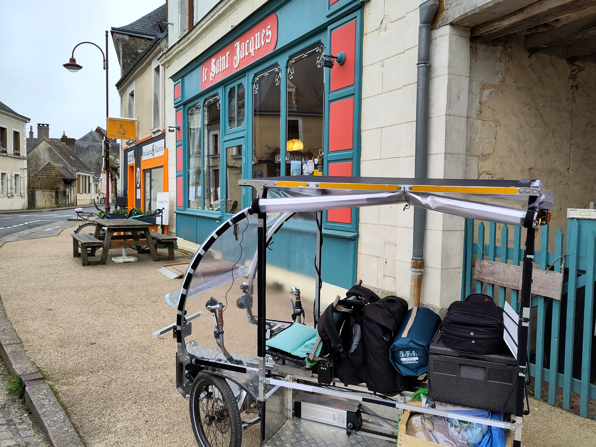

# En vidéo...
Retrouvez sur [la chaine youtube de la transiscapade](https://www.youtube.com/@Transiscapade), l'[Episode 3 - Brass'Vie à Jupilles](https://www.youtube.com/watch?v=Hyy5P06IiOQ)

# En détail...

## Bye bye Ecommoy, direction Jupilles

Suite à cette première visite de la ferme des herbes folles, j'avais rendez-vous entre 15h et 18h à 13 km.

J'étais un peu stressé de ne pas arriver à l'heure. En fait, je ne savais pas si le RDV était à 15h, ou "quand je voulais/pouvais", entre 15h et 18h...

(Du coup, je me suis fait attendre...)

Sur la route, j'ai rencontré un monsieur, qui marchait le long de la route, et qui est venu me parler.

## Un vélo couché vient à ma rencontre

J'avance à mon rythme, je m'approche tranquillement de Jupilles, quand tout à coup, je vois un vélo couché qui m'attend et qui redémarre à mes côtés!

C'est Hervé, un passionné de vélo qui m'attendait, il avait déjà fait 2 grand tours avant de me trouver... J'ai trouvé cela super sympa de sa part, nous avons discuté sur le chemin, j'ai appris qu'on pouvait faire plus de **200 km par jour** avec un vélo couché !

## Arrivée au Saint-Jacques

Le [Saint-Jacques](https://vlap.fr/labrassviedejupilles/) est le lieu associatif où se déroulent principalement les activités de la ["Brass'vie"](https://vlap.fr/labrassviedejupilles/). C'est un lieu géré par une SCI d'une soixantaine de personnes, dans lequel se passent régulièrement des animations, des ateliers, des concerts, des réflexions philosophiques, du lâchage vocal, du clown, et surtout, des repas concoctés par une équipe de bénévols motivée ! :)

A mon arrivée, une vingtaine d'habitants étaient présents pour voir le vhélio. Un journaliste local est venu me poser des questions sur mon projet, que d'émotions ! J'ai eu le droit à un article dans le journal local (voir la rubrique de presse dans le [menu](http://localhost:4321/accueil/presse)...). Ensuite, c'était à moi de faire plusieurs vidéos, pour essayer de faire ressentir l'ambiance du lieu.

## Jupilles

En tous cas, si vous passez dans le coin, ça vaut le coup de passer à Jupilles, car il s'y passe forcément quelque chose (voir [l'agenda](https://vlap.fr/labrassviedejupilles/agenda-collectif/)). Inscrivez-vous à la newsletter et recevez ainsi toutes les semaines le programme.

Vous retrouvez aussi non loin de là le fameux lieu de Freda et Pascal, [Crocus](https://escampe.fr/permaculture/?page_id=185), géré par l'association de permaculture [L'Escampe](https://escampe.fr/permaculture/?page_id=25)

Mais aussi [Carnuta](https://www.carnuta.fr/), la maison de l'homme et de la foret, et biensur la **forêt de Bercé**.

## En route pour Lavernat !

Une fois les interviews terminées, Yoan a monté son vélo et m'a accompagné sous la pluie jusqu'à chez lui. Nous en avons eu pour une heure de route, et nous avons rencontré Maxime, qui est resté avec nous.

## Une première journée bien remplie
Ce fut une journée pleine d'émotions, de rencontres, de soleil, de pluie, d'organisation... 

Dans le prochain épisode, départ pour Tours !

## Projet Permalieux
Retrouvez plus d'informations sur **certains lieux permaculturels de Jupilles, de Vaas ou de Lavernat** sur le **PAD** du projet [Permalieux](https://paper.dropbox.com/doc/Permalieux-72-IlbDvuBKKhOERQtgZqiz2) > [Liste des permalieux visités](https://paper.dropbox.com/doc/Liste-des-permalieux-visites-auX6lhoT0BAJ9rh3kCl2w)

# En photo...

## Ecommoy > Jupilles

