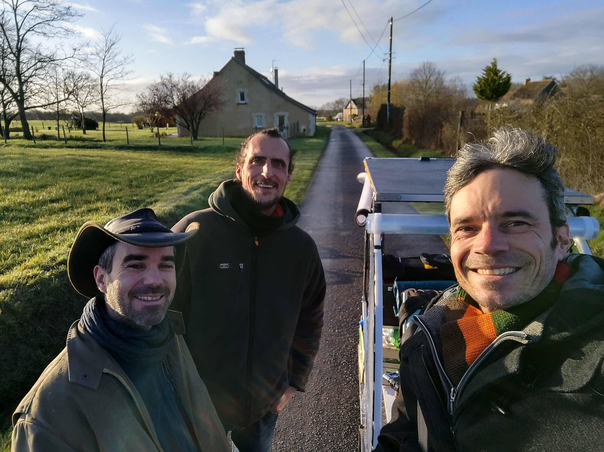
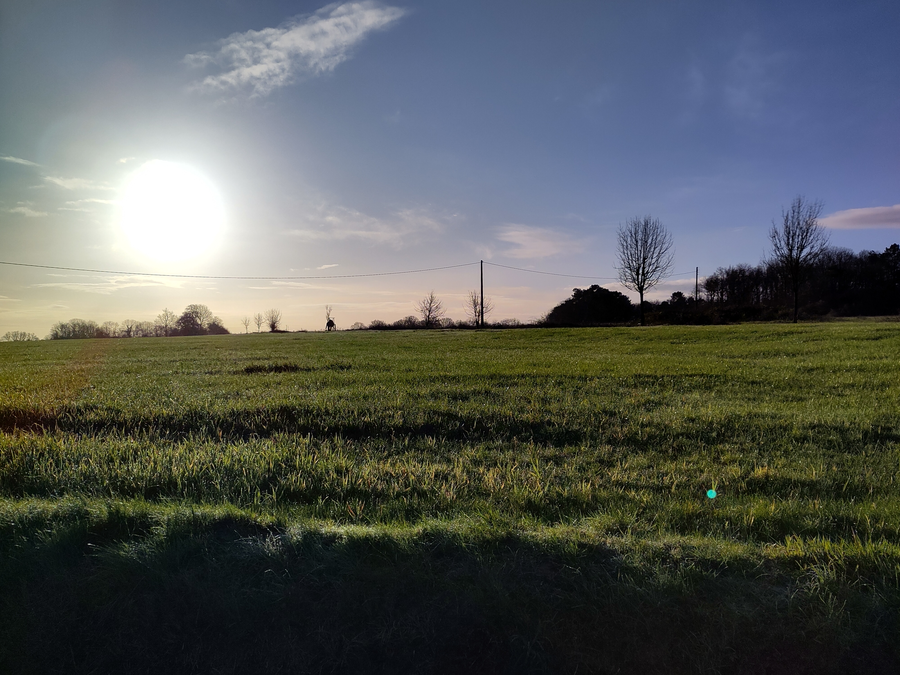
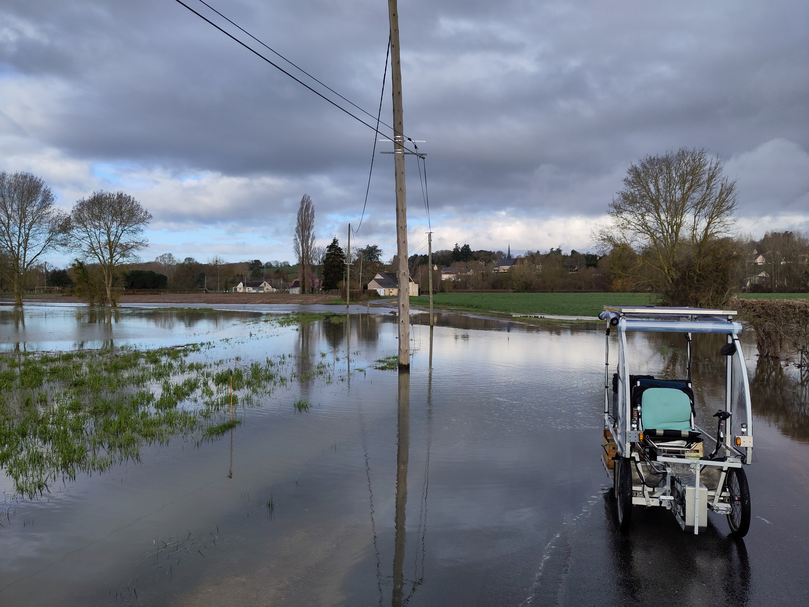
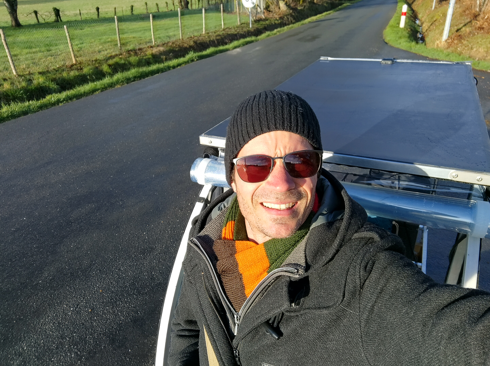

# En vidéo...
Retrouvez sur [la chaine youtube de la transiscapade](https://www.youtube.com/@Transiscapade), l'[Episode 4 - Inondations entre Jupilles et Tours](https://www.youtube.com/watch?v=9Bjl1kWSwN0)

# En détail...

## Je quitte Lavernat, les copains...

Après une bonne nuit chez Yoan, je retrouve les copains pour le départ, ils m'accompagnent sur le chemin, le sourire aux lèvres, on fait des photos, des vidéos, il fait beau, un peu froid, mais ça va. Je vérifie une dernière fois que j'ai bien tout, et c'est parti ! Bye bye les copains, et encore merci pour ces bons moments !

## La campagne est magnifique

Ciel bleu, soleil qui commence à monter, mais je suis bien avec mes gants et mon bonnet. Je suis un peu fier de mon vhélio, je m'arrête, je prends des selfies pour les réseaux...

La route se passe bien, tranquillement, mais je sais que je ne dois pas trainer, car je dois faire 65 km aujourd'hui jusqu'à Montlouis sur Loire.

## Première inondation

Tout à coup, j'arrive devant une immense étendue d'eau qui est passée par dessus la route !

A la fois c'est magnifique, mais je me demande si je vais passer... Ca n'a pas l'air très profond, mais je me dis qu'il ne faut pas que ça vienne toucher les câbles électriques du vhelio !

J'avance lentement, finalement, il n'y a que 5 cm de hauteur, donc ça va... Je recommence à faire le malin, à prendre des photos, etc... :)

J'ai aussi une pensée pour les problèmes d'inondations plus globalement, et je ne peux m'empêcher de me demander s'il y en a de plus en plus, ou si ça arrive tous les ans, et que c'est "normal"... Dans le cas présent, je n'en sais rien.

## Deuxième inondation !

1 km plus loin, me voilà devant une nouvelle inondation !

Je m'approche, je regarde autour, j'hésite.
J'attends un peu, et tout à coup, j'entends un pêcheur qui appelle des amis.

Je m'approche de lui et je lui demande : 
- "vous croyez que ça passe par là ?".
- Il me répond : "vous pouvez essayer, mais a mon avis, il y a un mètre de profondeur !!".

Aouutch ! J'ai bien fait d'attendre un peu avant de me lancer ! Par où vais-je pouvoir passer ?

Je regarde mon GPS, ouf, je peux contourner par une autre route, mais ça me rallonge pas mal...

C'est parti, je fais le tour !

## Suite du voyage

La suite du voyage s'est bien passé, il a continué à faire beau, j'étais assez seul sur des petites routes (j'appelle des petites routes, celles qui n'ont pas de bandes pointillées au milieu...), je teste mes premières petites montées, tout va bien.

J'ai fait une pose vers 11h, mais ça, c'est le début de l'épisode 5 !... :)

# Photos en pagaille

