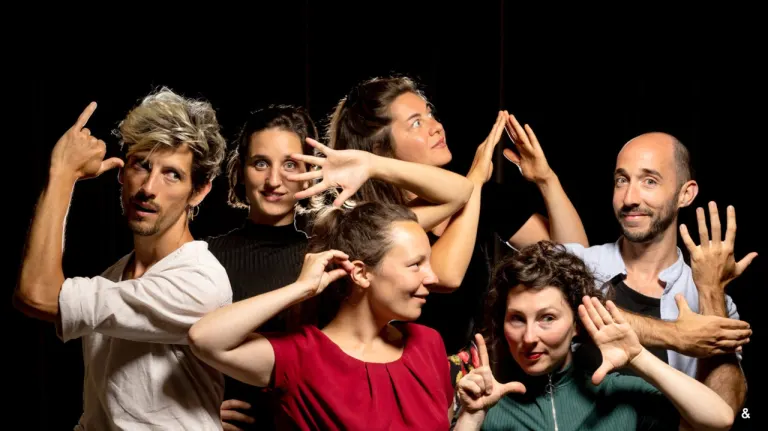
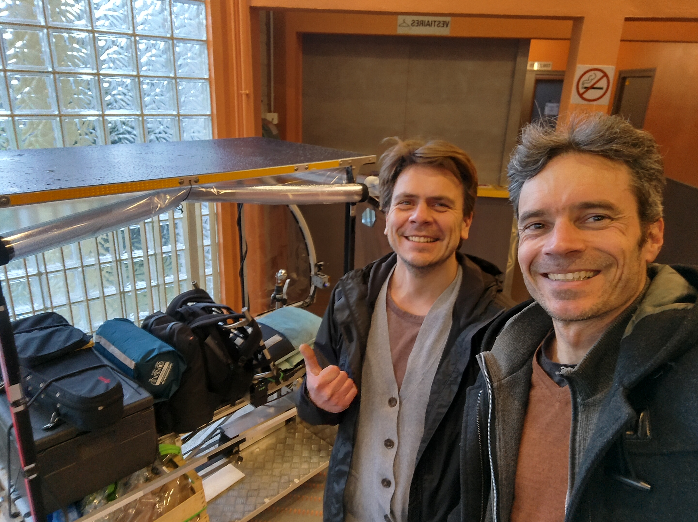
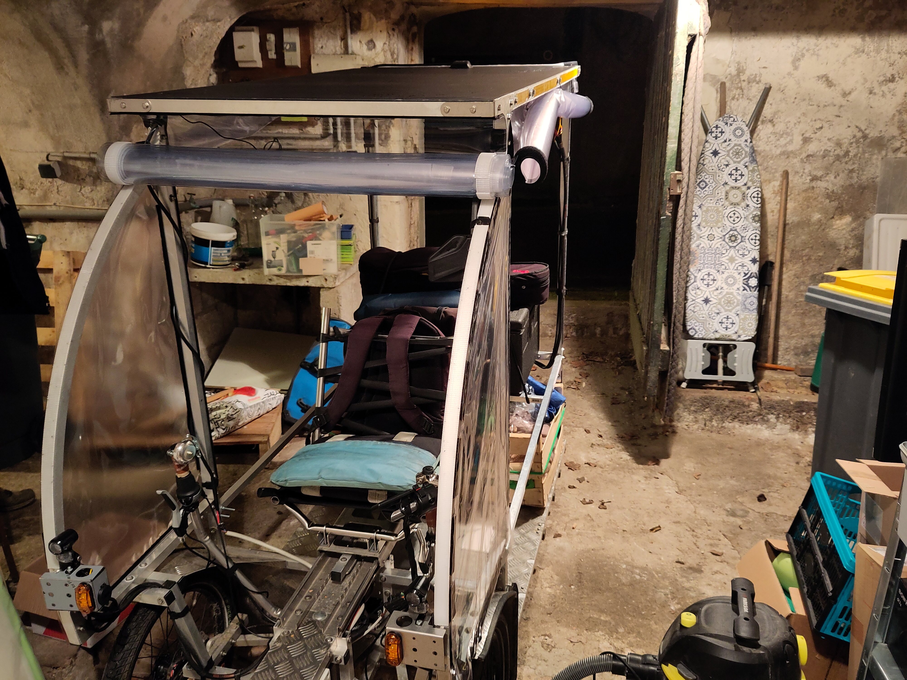

# En vidéo...
Retrouvez sur [la chaine youtube de la transiscapade](https://www.youtube.com/@Transiscapade), l'[Episode 5 - Internet associatif à Tours](https://www.youtube.com/watch?v=ZK6nQxi__4Q)

# En détail...

## Résumé
Suite de cette deuxième journée de la Transiscapade, après cet épisode 04 parlant des inondations, je repars vers **Tours** où je ferai une interview d'un ami informaticien au sujet d'un **FAI associatif**, j'emprunterai la voie verte de la **Loire à vélo**, puis, en fin de journée, je participerai par un super spectacle de chant à **MontLouis-sur-Loire**, pour terminer par une dernière portion jusqu'à Amboise chez une amie qui m'héberge (de nuit...).

## Petite pause de 11h...

Après une heure et demi à pédaler, je me dis qu'il faut que je reprenne des forces ! Ah ah. En effet, je suis parti avec une belle intention de faire attention à mon alimentation, en emportant avec moi des oléagineux, des fruits secs et des céréales. Lorsque je m'arrête, je m'étire, je bois bien, et je mange un truc.

## Un point sur la journée

C'est une grosse journée, 65 km (vous verrez que je n'en ferai pas beaucoup plus par jour...), j'en avais fait environ une vingtaine (voir Episode 04), donc il m'en restait encore 40 km !

Le ciel est nuageux, mais il me reste encore la moitié de la batterie.

La route n'a rien d'excitante, mais ce sont de petites routes de campagne, peu empruntées, donc je suis tranquille.

## Sandwish à l'entrée de Tours

Je commence à entrer dans Tours vers 15h, j'ai pris un sandwich et un super feuilleté banane chocolat (une tuerie ce truc, j'ai même essayé de le refaire avec un croissant et de la pate à tartinée plus tard...).

## Interview de Sebastien

Voilà au moins un an que je n'avais pas revu Sébastien, que je connaissais depuis un moment car faisant partie du réseau monnaie libre de Tours, et qui m'avait installé à l'époque sur mon téléphone portable (S2) une distribution [Lineage OS](https://lineageos.org/), bref, un geek, un libriste, un vrai !

Au début, je voulais passer voir le [Potager de Loire](https://lepotagerdeloire.fr/), mais Yolain n'était pas dispo (ce sera pour le retour !). Donc sur les conseils de Yoan (Jupilles), j'ai contacté Sébastien, et il était dispo !

En avant donc pour le retrouver dans les locaux de son employeur actuel, pour parler de son association Alpha Net, qui permet de souscrire un abonnement uniquement à Internet (sans la TV ni téléphone...).

C'est mon deuxième interview, je suis un peu crispé, mais en deux/trois prises, c'était OK. Cool, car j'ai rendez-vous à Montlouis pour aller voir un spectacle de chant (surprise !).

Lorsque nous sortons, nous remarquons qu'il a plu... Je suis bien content d'avoir été au sec (vous verrez que ce genre de scénario s'est répété jusqu'à Marseille...).

## Voie verte direction Montlouis

En quittant Tours pour Montlouis-sur-Loire, je passe par la fameuse voie verte de [La Loire à vélo](https://www.loireavelo.fr/). Première fois pour moi que je découvre vraiment un chemin concu spécialement pour les piétons et les cyclistes.

Entouré de verdure..., avec à ma gauche, **la Loire**, et autour de moi un paysage arboré, c'est très agréable à vivre. Je me sens fier d'emprunter une voie cyclable qui va de Saint-Brévin jusqu'à Nevers ... Je rêverais de pouvoir aller de ville en ville en utilisant uniquement des voies comme celle-là ! :) Malheureusement, pour des contraintes de temps, je ne vais pas pouvoir passer par **Orléans**, ville amblématique dans laquelle sont nés des projets de vélos innovants comme le [Vhélio](www.vhelio.org) ! et le [Pi-pop](https://pi-pop.fr/)).

## Arrivée à l'heure à Montlouis-sur-Loire

Je suis assez fier d'arriver à Montlouis vers 17h, je suis dans les temps pour le spectacle.
En effet, j'ai rendez-vous avec Cyrielle à 18h pour un spectacle "surprise". Il faut savoir que je la connais via un collectif qui organise régulièrement des **circle songs** sur Tours. J'y ai participé pendant un au à l'époque où je travaillais un peu sur Tours, et j'ai pu y rencontrer une belle bande joyeuse...

## Spectacle magique de la compagnie "Bouche-bée"

J'ai tellement été captivé, enchanté, bousculé, enivré par ce spectacle que je ne peux pas m'empêcher d'en faire la promotion ici ! La compagnie s'appelle **"Bouche-bée"** et le spectacle s'intitule [Quand la musique s'éveille au chant du corps](https://www.lanouvellerepublique.fr/indre-et-loire/commune/montlouis-sur-loire/montlouis-sur-loire-avec-bouche-bee-quand-la-musique-s-eveille-au-chant-du-corps), et ce titre colle tout à fait à ce que j'ai vécu...

Les **6 artistes**, à la fois très très bons chanteureuses et chorégraphes, répétaient pour une dernière fois (sortie de résidence) leur spectacle dans cette grande salle de Montlouis. Une quarantaine de personnes, assis sur des bancs répartis un peu partout dans la salle, et tout à coup, ils nous encerclent, en sortant des sons, puis de la gestuelle. Pas vraiment de la danse, mais des gestuelles qui ont l'air de signifier des choses. Et puis ils nous invitent à les suivre, nous nous levons, les bancs se déplacent, nous les suivons, ils se mettent à l'intérieur, nouvelle chorégraphie, nouvelle reprise, je reconnais Sting, mais comme je ne l'ai jamais entendu... J'ai envie de chanter, mais je me retiens, et tout mon être vibre à l'écoute de leurs voix à la fois discrètes et puissantes, délicates, frolantes mais justes et originales... Ils nous demandent une nouvelle fois de les suivre et de danser avec eux, puis je me retrouve par terre, assis, ils sont en assis eux aussi, en cercle, et je vibre de l'intérieur comme jamais... Un régal pour mes oreilles, pour mon âme...

Je m'arrête là, car l'objectif n'est pas de tout raconter, mais de vous donner envie de les suivre, ils sont en tournée dans toute la france...

Voir [Polyphonie a cappella mouvementée](https://www.cepravoi.fr/mag/2024/02/bouche-bee-polyphonie-a-cappella-mouvementee/)

## Belles rencontres...

En discutant avant et après le spectacle avec d'autres personnes, j'ai pu rencontrer des personnes que j'ai beaucoup envie d'aller voir à mon retour. Le vhélio est un extraordinaire prétexte à discuter et à rencontrer des curieux.ses. Je m'en réjouis !

Bon, il faut dire que, par raison de sécurité, j'avais carrément rentré le vhélio dans l'entrée de la salle... lol

## Direction Amboise pour le dodo...

Après le spectacle, il me reste encore une heure de vélo pour aller chez Cyrielle... Ca en fait des km pour le deuxième jour ! Cela me permet de tester le vhélio de nuit, il fait froid, la nuit est noire, mais les phares fonctionnent bien et la route se passe bien.

Arrivée chez Cyrielle, je lui avais donné les dimensions du vhélio pour savoir si elle avait un garage, et en effet, elle avait une cave, et le vhélio est passé à quelques centimètres près, que ce soit en hauteur ou en largeur, ouf ! :)
